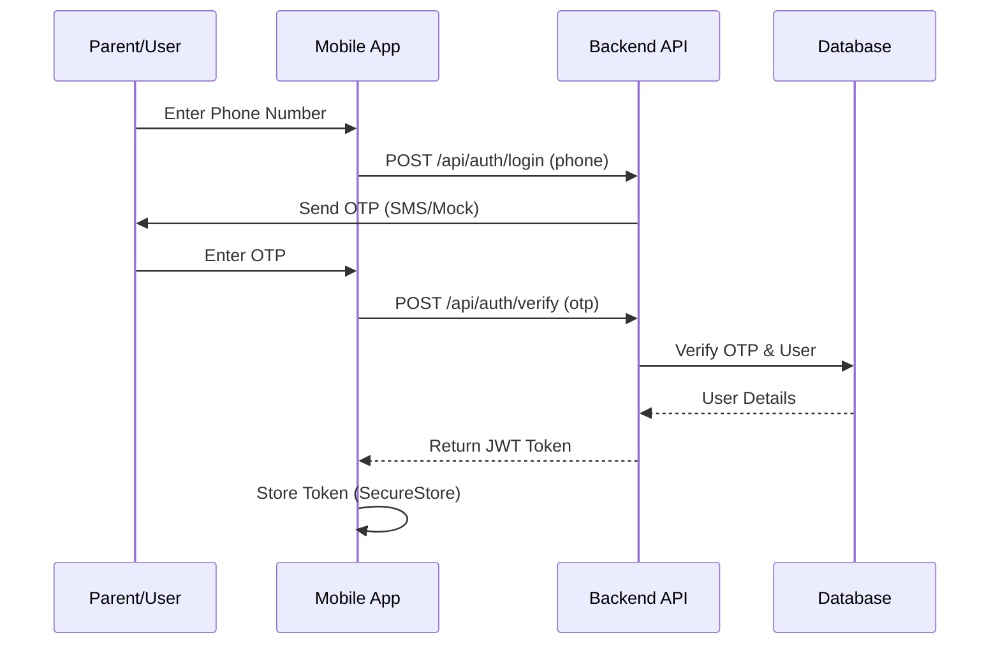
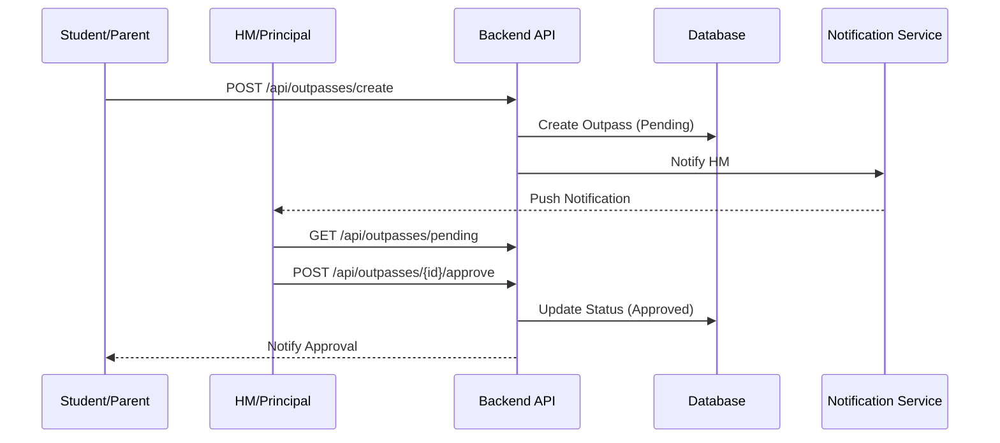
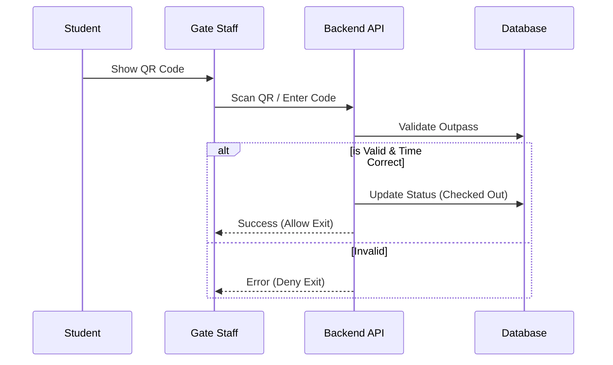

# Outpass Management System Documentation

Welcome to the documentation for the Outpass Management System. This system streamlines the process of issuing, approving, and verifying student outpasses for hostels.

## System Overview

The system consists of three main components:
1.  **Backend**: The core logic and database (Django).
2.  **Mobile App**: For Parents (requests), Wardens (hostel management/vacating), HM/Principal (approvals & meetings), and Gate Staff (verification).
3.  **Admin Portal**: For School Administrators (user management, analytics).

```mermaid
graph TD
    User[Users]
    subgraph Frontend
        Mobile[Mobile App (Expo)]
        Admin[Admin Portal (React)]
    end
    subgraph Backend
        API[Django REST API]
        DB[(SQLite Database)]
    end

    User --> Mobile
    User --> Admin
    Mobile -->|HTTP Requests| API
    Admin -->|HTTP Requests| API
    API --> DB
```

## System Flows

### 1. Login Flow (Mobile)


### 2. Outpass Request & Approval


### 3. Gate Exit Flow


## Documentation Modules

### [Database Documentation](./database.md)
Detailed ER diagram, schema definitions, and entity relationships.

### [Backend Documentation](./backend.md)
Detailed guide on setting up the Django backend, API structure, and database management.

### [Mobile App Documentation](./mobile.md)
Instructions for setting up the React Native (Expo) app, configuring API endpoints, and understanding user flows.

### [Admin Portal Documentation](./admin_portal.md)
Guide for the web-based administration dashboard, including setup and feature overview.

## Quick Start
To get the entire system running locally, you need to start all three servers:
1.  **Backend**: `python manage.py runserver 0.0.0.0:8000` inside `backend/`.
2.  **Mobile**: `npx expo start` inside `mobile/`.
3.  **Admin**: `npm run dev` inside `admin-portal/`.
